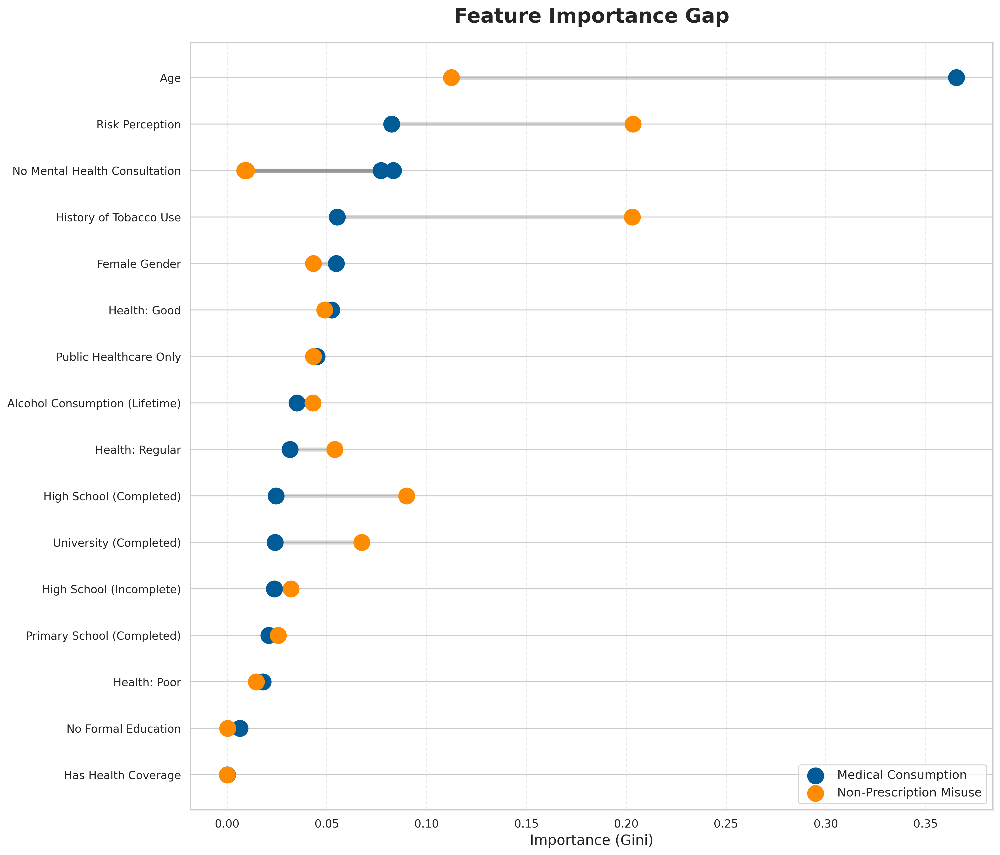

# Predicting tranquilizer misuse in Argentina based on the ENCOPRAC 2022


## Abstract
This study investigates the behavioral determinants of psychotropic substance consumption in Argentina, distinguishing between medical use and non-prescription misuse (self-medication). Utilizing data from the ENCOPRAC 2022 National Survey (N=~7,200), two random forest classifiers were developed to identify predictors for each consumption profile. The analysis highlights a structural dissociation: while general consumption is predicted by demographic and systemic factors like age and healthcare access), misuse is primarily driven by behavioral covariates (risk perception, tobacco use history). To address severe class imbalance (<2% prevalence of misuse), the study employed SMOTE (Synthetic Minority Over-sampling Technique), achieving a recall of 0.59 in the detection of at-risk users.

---
## Introduction
The consumption of tranquilizers without medical supervision represents a significant public health challenge. Traditional statistical methods often fail to detect rare events in population surveys. 

---
## Objectives
1.  Isolate the drivers of self-medication compared to general consumption (prescribed or not).
2.  Evaluate the efficacy of random forest combined with resampling techniques to predict rare behavioral risks.

---
## Methodology
The dataset was derived from the National Survey on Consumption and Care Practices (ENCOPRAC 2022) conducted by INDEC, Argentina. The preprocessing included the handling of skip-patterns and imputation of non-response codes. Categorical variables (Education, Health Coverage, Risk Perception) were encoded as indicators.

Two distinct binary classification models were trained. One predicting general lifetime consumption and another predicting lifetime consumption without prescription.

The non-prescription target presented a severe imbalance (positive class < 2%). A standard approach yielded high accuracy but null sensitivity (recall = 0.00).
The solution was the implementation of SMOTE on the training set to synthesize minority class examples based on nearest neighbors. The decision threshold was calibrated from 0.50 down to 0.15. This was a deliberate analytical decision to prioritize sensitivity over precision. Given the preventive nature of public health screening, the cost of missing a potential at-risk case (false negative) is considered higher than incorrectly flagging a user (false positive).
While the baseline model presented a high accuracy (96%) but null sensitivity (recall = 0.00), the final model, improved with SMOTE, presents a recall of 0.59. Although global accuracy decreases (trade-off), the model successfully identifies ~60% of at-risk users, making it functional for screening purposes.

---

## Results 

Feature importance analysis with Gini Impurity reveals that the two behaviors are governed by different mechanisms. General Consumption is strongly predicted by age and contact with the mental health system. It follows a clinical, structural pattern. On the other hand, on Non-Prescription Misuse the influence of age diminishes significantly. Instead, risk perception and other substances use history, like tobacco, emerge as dominant predictors.


*Figure 1: Dumbbell chart illustrating the shift in feature importance between the General Model in blue and the Misuse Model in orange.*

A correlation analysis confirms the direction of these effects. A high perception of risk acts as a significant deterrent (negative correlation) for self-medication. A history of tobacco consumption acts as a positive driver for tranquilizer misuse, suggesting a behavioral cluster of risk-taking.


*Figure 2: Diverging bars displaying drivers (in green) and deterrents (in red) for each target variable.*

---

## Discussion
The findings suggest that public health interventions targeting tranquilizer misuse cannot rely on the same demographic profiling used for general users. While general consumption is a function of aging and healthcare access, misuse is a behavioral phenomenon driven by low risk perception. This implies that prevention campaigns should focus on psycho-education regarding risk, particularly among younger demographics who are invisible to standard clinical screenings.

---
## Limitations

While the model successfully identifies behavioral patterns, several limitations must be acknowledged. 
The analysis relies on complete cases, which may underrepresent populations with higher non-response rates. Additionally, substance misuse is often underreported due to social desirability bias.
The random forest Gini importance metric can be biased towards continuous variables or categorical variables with high cardinality. Therefore, the ranking of features should be interpreted as indicative of predictive power, not necessarily causal magnitude.
Moreover, the ENCOPRAC 2022 dataset provides a snapshot in time because of its cross-sectional nature. The relationships identified represent statistical associations, limiting causal inference.
Finally, the use of SMOTE introduces synthetic examples to balance the minority class. While necessary for training, this may over-smooth decision boundaries compared to real-world data distributions.

---

## Reproducibility
To replicate this analysis:

1.  **Environment:** Python 3.9+ with libraries listed in `requirements.txt`.
2.  **Execution:** Run the Jupyter Notebook located in the `notebook/` directory.
    ```bash
    pip install -r requirements.txt
    jupyter notebook notebook/tranquilizer_misuse_analysis.ipynb
    ```

---

By **Juana Luz Carbajal** 

[](https://www.linkedin.com/in/juanaluz/)
